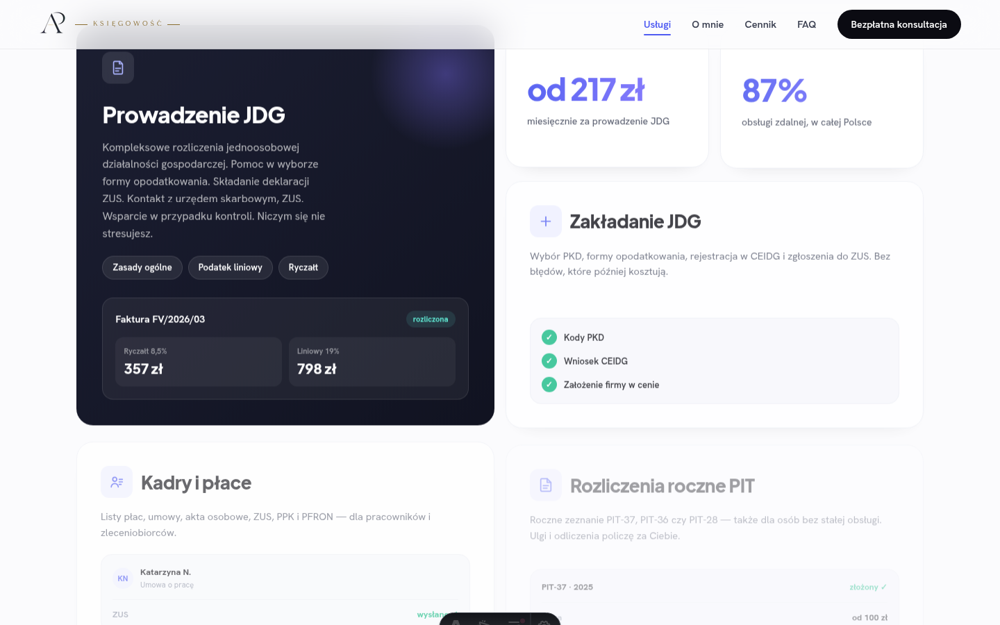
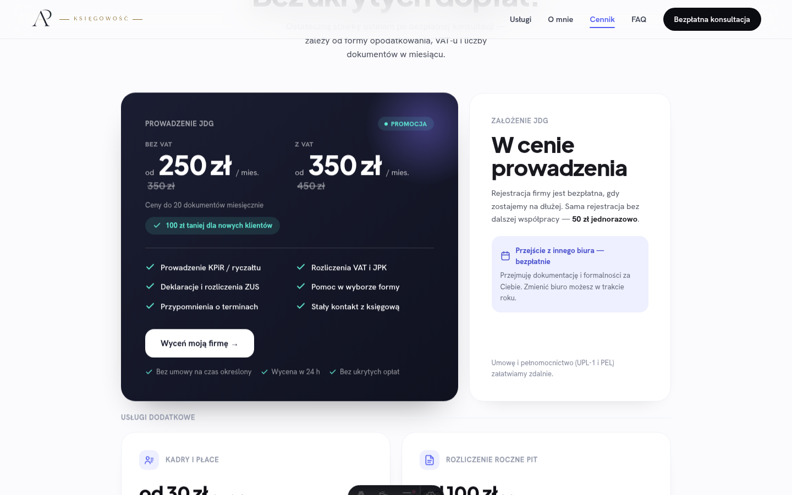
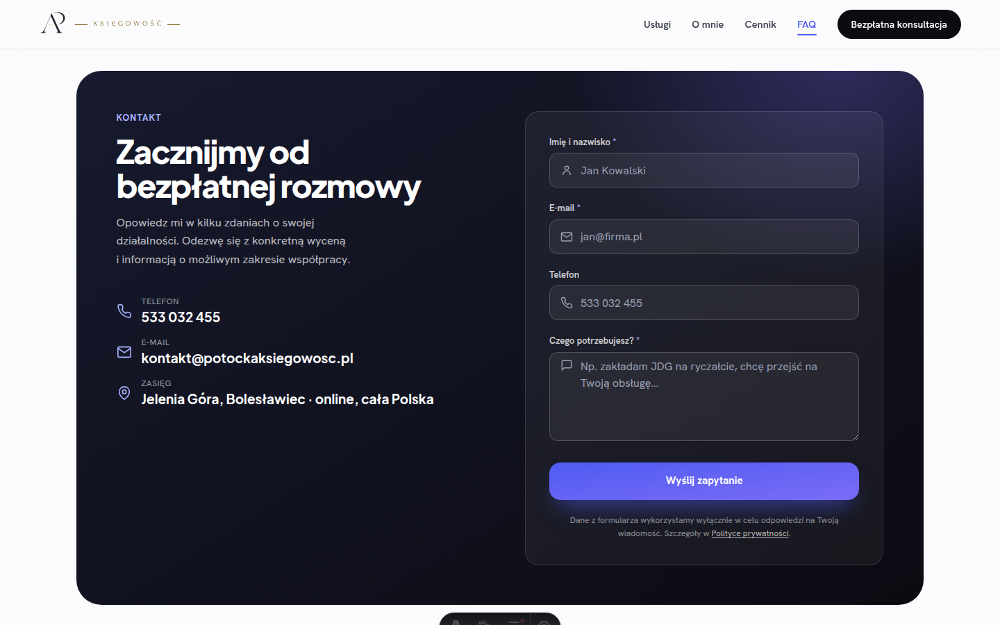

<p align="center">
  
</p>

<h1 align="center">Aleksandra Potocka — Księgowość</h1>

<p align="center">
  Strona-wizytówka biura księgowego, zbudowana w Astro + TypeScript + Tailwind CSS.
</p>

Jednostronicowa witryna marketingowa dla jednoosobowego biura księgowego
(Jelenia Góra / Bolesławiec, obsługa zdalna w całej Polsce). Prezentuje ofertę,
cennik i doświadczenie księgowej, a odwiedzający mogą od razu zapytać o
bezpłatną konsultację przez formularz kontaktowy.

## Zrzuty ekranu

### Desktop

| Hero | Usługi | Cennik | Kontakt |
|---|---|---|---|
|  |  |  |  |

### Mobile

| Hero | Usługi | Cennik | Kontakt |
|---|---|---|---|
|  |  |  |  |

## Sekcje strony

Strona (`src/pages/index.astro`) składa się z jednej długiej strony głównej,
podzielonej na następujące sekcje — każda to osobny komponent w
`src/components/`:

| Sekcja | Komponent | Opis |
|---|---|---|
| Nawigacja | `layout/Header.astro` | Sticky nagłówek z linkami do sekcji (scrollspy podświetla aktywny link), mobilne menu rozsuwane, przycisk „Bezpłatna konsultacja”. |
| Hero | `sections/Hero.astro` | Nagłówek strony, krótki opis oferty, dwa CTA („Umów konsultację” / „Zobacz cennik”), znaczki zaufania (UE Wrocław, 6 lat praktyki, 100% online) i portretowe zdjęcie z efektem paralaksy. |
| Używane programy | `sections/ToolsStrip.astro` | Pasek z logotypami/nazwami programów księgowych, z których korzysta biuro (Comarch Optima, Symfonia, Płatnik, Subiekt GT, Rachmistrz GT). |
| Usługi | `sections/Services.astro` | Siatka kafli z ofertą: prowadzenie JDG (zasady ogólne/liniowy/ryczałt), zakładanie JDG (CEIDG, ZUS), kadry i płace, roczne rozliczenia PIT — wraz z kaflami statystyk (cena od, % obsługi zdalnej). |
| Jak pracuję | `sections/ValueProps.astro` | Trzy karty na temat sposobu współpracy: stały kontakt, indywidualne podejście, księgowość w pełni online. |
| O mnie | `sections/About.astro` | Bio Aleksandry Potockiej (studia UE Wrocław, doradztwo podatkowe) i osobista linia czasu certyfikatów/kwalifikacji. |
| Cennik | `sections/Pricing.astro` | Widełki cenowe prowadzenia JDG (z VAT / bez VAT), co wchodzi w cenę, koszt założenia firmy oraz usługi dodatkowe (kadry i płace, PIT roczny). |
| Jak zaczynamy | `sections/Process.astro` | Cztery kroki onboardingu: bezpłatna konsultacja → umowa i pełnomocnictwo → przekazanie dokumentów → spokój i terminy. |
| FAQ | `sections/Faq.astro` | Rozwijana lista najczęściej zadawanych pytań (akordeon). |
| Kontakt | `sections/contact/ContactSection.astro` | Dane kontaktowe (telefon, e-mail, zasięg działania) oraz formularz kontaktowy z ochroną antyspamową, wysyłający zapytanie na e-mail biura. |
| Stopka | `layout/Footer.astro` | Stopka z danymi firmy i linkiem do polityki prywatności. |
| Mobilne CTA | `layout/MobileStickyCta.astro` | Przypięty do dołu ekranu pasek z przyciskiem kontaktu, widoczny tylko na urządzeniach mobilnych. Nie jest renderowany na `/ankieta`, żeby nie odciągał od wypełnianego formularza — strona przekazuje wtedy `hasMobileStickyCta={false}` do stopki, która rezerwuje miejsce pod pasek. |

Osobnymi podstronami są `src/pages/polityka-prywatnosci.astro` — polityka
prywatności wymagana przy przetwarzaniu danych z formularza kontaktowego —
oraz `src/pages/ankieta.astro` (adres `/ankieta`) — rozbudowana ankieta
o działalności klienta. Link do niej Aleksandra wysyła ręcznie (SMS, WhatsApp,
e-mail) przed rozmową; strona ma `noindex` i nie ma jej w menu ani stopce.

`src/pages/404.astro` obsługuje nieistniejące adresy. Build zapisuje ją jako
`404.html`, a adapter Vercela kieruje tam wszystko, czego nie złapał wcześniej
routing, ze statusem 404 — zamiast domyślnej strony Astro/Vercela użytkownik
dostaje stronę w identyfikacji wizualnej biura, z odnośnikami do usług,
cennika, FAQ i kontaktu.

## Funkcjonalności

- **Formularz kontaktowy** (`features/contact/`) — walidacja danych po stronie
  serwera (Zod), ochrona przed spamem (honeypot + minimalny czas wypełnienia +
  licznik zgłoszeń per IP), wysyłka e-maila powiadomienia do biura oraz
  potwierdzenia dla klienta przez Brevo.
- **Ankieta przed rozmową** (`features/intake/`, strona `/ankieta`) —
  kilkunastopolowy formularz w pięciu sekcjach (dane kontaktowe, o firmie,
  rozliczenia, obecna sytuacja, dodatkowe informacje), podzielony na osobne
  komponenty sekcji w `components/sections/intake/`. Aleksandra dostaje pełną
  ankietę z `Reply-To` klienta, a klient — kopię swoich odpowiedzi na maila.
  Ta sama ochrona antyspamowa co w formularzu kontaktowym; obie strony dzielą
  infrastrukturę mailową (`lib/email/`) i obsługę wysyłki w przeglądarce
  (`lib/forms/form-submission.ts`).
- **SEO** — tytuł, opis, meta Open Graph/Twitter oraz dane strukturalne
  `AccountingService` (JSON-LD) w `layouts/Layout.astro`.
- **Animacje** — subtelny efekt paralaksy na zdjęciu w hero, odkrywanie
  sekcji podczas scrollowania, animowane liczniki w statystykach — bez
  frameworka JS po stronie klienta, każda sekcja ma własny, mały inline
  `<script>`.
- **Responsywność** — pełne wsparcie mobile/desktop, mobilne menu i przypięte
  CTA na małych ekranach.

## Stack technologiczny

- [Astro 7](https://astro.build) — statyczne generowanie stron, plikowy
  routing
- TypeScript (strict)
- Tailwind CSS v4 (konfiguracja CSS-first przez `@theme`)
- [Zod](https://zod.dev) — walidacja danych z formularza
- [Brevo](https://www.brevo.com) — wysyłka e-maili transakcyjnych
- `@astrojs/vercel` — adapter wdrożenia (strona statyczna + jeden endpoint
  serverless dla formularza kontaktowego)

Więcej szczegółów architektonicznych: [ARCHITECTURE.md](./ARCHITECTURE.md).
Konwencje dla agentów AI pracujących w tym repo: [AGENTS.md](./AGENTS.md).

## Uruchomienie lokalnie

Wymagany Node.js `>=22.12.0`.

```bash
npm install
npm run dev       # serwer deweloperski na http://localhost:4321
npm run check     # sprawdzenie typów .astro/.ts
npm run build     # build produkcyjny do dist/
npm run preview   # podgląd builda produkcyjnego lokalnie
```

Aby formularz kontaktowy działał lokalnie, skopiuj `.env.example` do `.env`
i uzupełnij zmienne (klucz API Brevo, adresy e-mail nadawcy/odbiorcy
zgłoszeń) — szczegóły w samym pliku `.env.example`.

## Struktura projektu

```
src/
├── assets/            logo, self-hostowane fonty (.woff2)
├── components/
│   ├── ui/             elementy wielokrotnego użytku (Button, Icon, form/*)
│   ├── layout/          Header, Footer, MobileStickyCta
│   └── sections/        po jednym komponencie na sekcję strony głównej
├── features/
│   ├── contact/         walidacja formularza kontaktowego, szablony e-maili
│   └── intake/          ankieta: schema, opcje, podsumowanie, serwis, e-maile
├── layouts/             Layout.astro — head/meta/SEO/JSON-LD
├── lib/
│   ├── email/           wspólna wysyłka przez Brevo (provider, layout maila, config)
│   ├── forms/           wspólna obsługa wysyłki formularzy w przeglądarce
│   └── ...               drobne helpery (paralaksa, scroll-reveal, typografia)
├── pages/               routing plikowy; index.astro składa sekcje w jedną stronę
│   └── api/             endpointy serverless: contact.ts, intake.ts
└── styles/              global.css — import Tailwind + tokeny @theme
```

Pełny opis architektury i konwencji: [ARCHITECTURE.md](./ARCHITECTURE.md).

## Wdrożenie

Strona jest wdrażana na [Vercel](https://vercel.com) przez adapter
`@astrojs/vercel` — większość stron jest prerenderowana statycznie, a
formularz kontaktowy działa jako pojedyncza funkcja serverless. Domena
produkcyjna nie jest jeszcze skonfigurowana w `astro.config.mjs` (zobacz TODO
w tym pliku).
